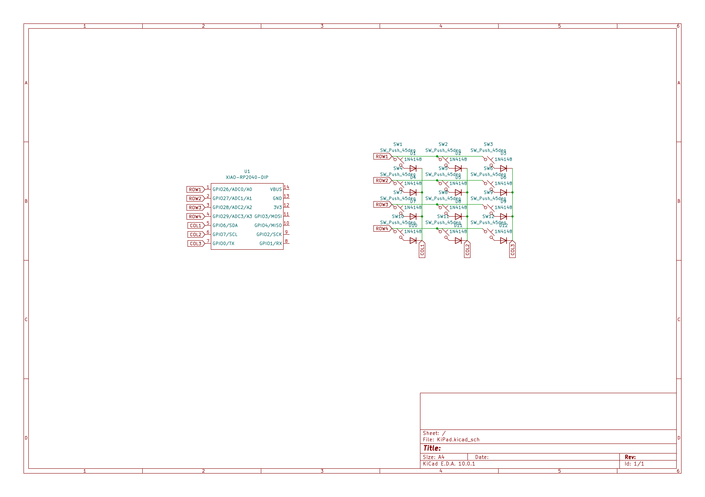
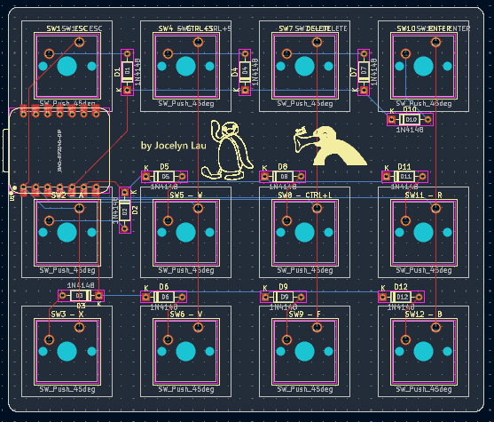
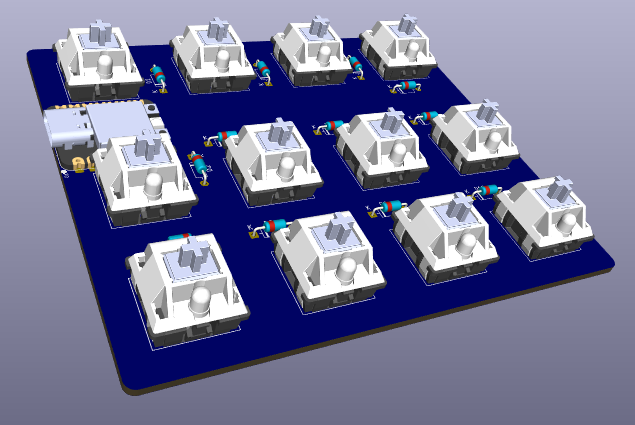
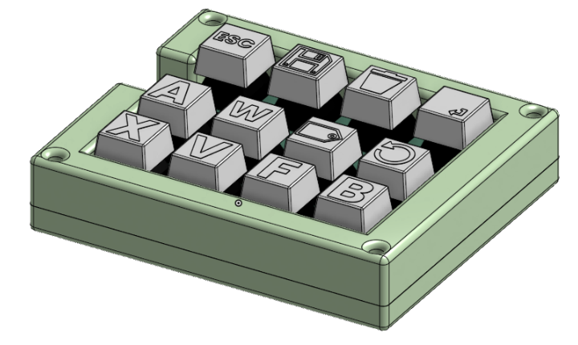

# KiPad
A macropad built for the most common KiCAD shortcuts. 

# User Instructions
Assembly: 
1. Print out and buy all the parts found in `BOM.csv`
2. Solder everything together
3. Put in the keycaps accordingly (refer to `3d-models/full-assembly.step` or pictures below)
4. Sandwich PCB between the top and the bottom case

Firmware: 
1. go to circuitpython.org/downloads
2. download circuitpython for XIAO RP2040
3. plug in keyboard to laptop and make sure to use a data transmitting cable
4. open up the pico folder in your computer's directory
5. replace the contents of `code.py` in the XIAO RP2040 folder with the one in this repo

# Why did I make it
I wanted to make the process of designing on KiCAD easier, so I made this macropad for this problem. 

# Diagrams
Schematic:  
  
PCB Editor:  
  
PCB Assembly:  
  
Full Assembly:  

# BOM
|Part|Amount|Price (USD)|
|----:|:-----|:------|
|Cherry MX Switches|12|$5.63|
|Keycaps|12 (1 of each design)|$0|
|XIAO RP2040|1|$13.15|
|PCB|1|$2|
|Case (top and bottom)|1 each|$0|